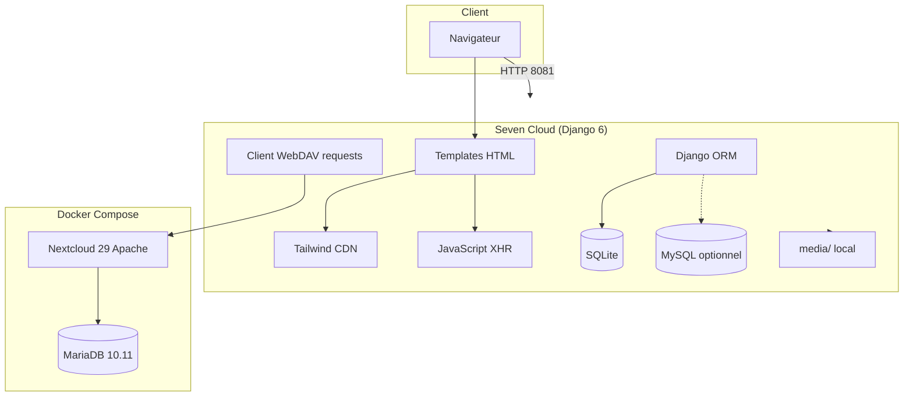

# Stack technologique — Seven Cloud

Document de référence listant l’ensemble des technologies, frameworks, bibliothèques et outils utilisés dans le projet **Seven Cloud** (plateforme cloud souveraine pour PME).

*Dernière mise à jour : mai 2026*

---

## Table des matières

1. [Vue d’ensemble](#1-vue-densemble)
2. [Langages et runtimes](#2-langages-et-runtimes)
3. [Backend — application web](#3-backend--application-web)
4. [Base de données](#4-base-de-données)
5. [Stockage de fichiers](#5-stockage-de-fichiers)
6. [Frontend et interface utilisateur](#6-frontend-et-interface-utilisateur)
7. [Infrastructure et conteneurisation](#7-infrastructure-et-conteneurisation)
8. [Configuration et variables d’environnement](#8-configuration-et-variables-denvironnement)
9. [Outils de développement](#9-outils-de-développement)
10. [Sécurité et authentification](#10-sécurité-et-authentification)
11. [Ce qui n’est pas utilisé](#11-ce-qui-nest-pas-utilisé)
12. [Versions et fichiers sources](#12-versions-et-fichiers-sources)

---

## 1. Vue d’ensemble

| Couche | Technologies principales |
|--------|--------------------------|
| **Application métier** | Python 3.12, Django 6 |
| **Interface** | Templates Django, Tailwind CSS (CDN), JavaScript natif |
| **Données applicatives** | SQLite (dev) ou MySQL/MariaDB (optionnel) |
| **Stockage fichiers** | Dossier `media/` (local) ou **Nextcloud** (WebDAV) |
| **Données Nextcloud** | MariaDB 10.11 |
| **Orchestration** | Docker, Docker Compose |
| **Serveur applicatif (dev)** | `runserver` Django (port 8081) |

```
Navigateur
    └── Django 6 (Python) — port 8081
            ├── SQLite / MySQL (métadonnées, utilisateurs, quotas)
            ├── media/ (fichiers locaux)
            └── Nextcloud 29 (WebDAV) — port 8085
                    └── MariaDB 10.11 — port 3306
```

---

## 2. Langages et runtimes

| Technologie | Version / détail | Usage |
|-------------|------------------|--------|
| **Python** | 3.11+ (recommandé), **3.12** dans Docker | Langage principal du backend |
| **HTML** | 5 | Templates dans `interfaces/` |
| **CSS** | via Tailwind + styles inline | Mise en forme des pages |
| **JavaScript** | ES5+ (vanilla, sans framework) | Upload AJAX, interactions UI |
| **SQL** | — | Migrations Django, requêtes ORM |
| **YAML** | — | `docker-compose.yml` |
| **Shell** | `sh` | Commandes de démarrage Docker |

---

## 3. Backend — application web

### Framework

| Technologie | Version | Rôle |
|-------------|---------|------|
| **Django** | 6.x (`>=6.0,<7.0`) | Framework web : routes, ORM, auth, admin, templates |
| **WSGI** | intégré Django | Point d’entrée serveur (`core/wsgi.py`) |

### Structure du projet Django

| Élément | Chemin / nom |
|---------|----------------|
| Projet Django | `core/` (`settings.py`, `urls.py`, `wsgi.py`) |
| Application métier | `survey/` |
| Commandes management | `survey/management/commands/` |
| Middleware custom | `survey.middleware.NoCacheAuthenticatedMiddleware` |
| Tags template custom | `survey/templatetags/avatar_tags.py` |

### Dépendances Python (`requirements.txt`)

| Paquet | Version | Rôle |
|--------|---------|------|
| **Django** | `>=6.0,<7.0` | Framework web |
| **Pillow** | `>=10.0` | Traitement images (photos PME, profils) |
| **requests** | `>=2.31.0` | Client HTTP pour WebDAV Nextcloud |
| **python-dotenv** | `>=1.0.0` | Chargement du fichier `.env` |

### Dépendance optionnelle (non listée dans `requirements.txt`)

| Paquet | Usage |
|--------|--------|
| **mysqlclient** | Driver MySQL pour Django si `DJANGO_USE_MYSQL=true` |

### Modules Django utilisés

- `django.contrib.admin` — interface d’administration native
- `django.contrib.auth` — utilisateurs, sessions, mots de passe
- `django.contrib.sessions` — sessions utilisateur
- `django.contrib.messages` — messages flash
- `django.contrib.staticfiles` — fichiers statiques
- `django.contrib.contenttypes` — types de contenu génériques

### Services métier (`survey/services/`)

| Module | Technologie / protocole | Rôle |
|--------|-------------------------|------|
| `nextcloud.py` | WebDAV (HTTP PUT/GET/DELETE/MKCOL), `requests`, Basic Auth | Upload, téléchargement, suppression sur Nextcloud |
| `fichiers.py` | Abstraction Django | Upload unifié (local ou Nextcloud) |
| `quota.py` | ORM Django | Vérification et statistiques des quotas |

### API et endpoints

| Type | Exemple | Technologie |
|------|---------|-------------|
| Vues fonction | `survey/views.py` | Django views |
| Réponses JSON | `/api/fichiers/upload/` | `JsonResponse` |
| Téléchargement | `/fichiers/<id>/telecharger/` | `FileResponse` / proxy Nextcloud |
| Formulaires | `survey/forms.py` | Django Forms |

---

## 4. Base de données

### Django (métadonnées applicatives)

| Moteur | Configuration | Usage par défaut |
|--------|---------------|------------------|
| **SQLite 3** | `db.sqlite3` à la racine | Développement (`DJANGO_USE_MYSQL=false`) |
| **MySQL** | `django.db.backends.mysql` | Production optionnelle (`DJANGO_USE_MYSQL=true`) |

### MariaDB (Nextcloud uniquement)

| Technologie | Version | Rôle |
|-------------|---------|------|
| **MariaDB** | **10.11** (image Docker `mariadb:10.11`) | Base de données exclusive à Nextcloud |
| Base | `seven_cloud_db` | Données Nextcloud |
| Utilisateur | `seven_user` | Compte applicatif Nextcloud |
| Port exposé | `3306` | Accès hôte (dev) |

> **Note** : en développement, Django et Nextcloud peuvent utiliser des bases distinctes. MariaDB du `docker-compose` sert principalement à Nextcloud ; Django utilise SQLite par défaut.

### ORM et migrations

- **Django ORM** — modèles dans `survey/models.py` (`PME`, `UserProfile`, `Fichier`, `Dossier`, demandes, etc.)
- **Migrations** — `survey/migrations/` (0001 à 0008+)

---

## 5. Stockage de fichiers

### Mode local

| Technologie | Chemin | Condition |
|-------------|--------|-----------|
| Système de fichiers | `media/` (`MEDIA_ROOT`) | `NEXTCLOUD_ENABLED=false` |
| Django `FileField` / `ImageField` | ORM + Pillow | Métadonnées en base |

### Mode Nextcloud

| Technologie | Version | Rôle |
|-------------|---------|------|
| **Nextcloud** | **29** (`nextcloud:29-apache`) | Stockage cloud, interface Web, WebDAV |
| **Apache HTTP Server** | (inclus dans l’image Nextcloud) | Serveur web du conteneur Nextcloud |
| **WebDAV** | `remote.php/dav/files/<user>/` | Protocole d’échange fichiers |
| **HTTP Basic Auth** | `requests.auth.HTTPBasicAuth` | Authentification API (mot de passe d’application recommandé) |

### Arborescence distante Nextcloud

```
SevenCloud/<slug_pme>/<username>/<fichier>
```

### Commandes de gestion du stockage

| Commande | Rôle |
|----------|------|
| `python manage.py check_nextcloud` | Test de connectivité (`status.php`) |
| `python manage.py migrate_to_nextcloud` | Migration fichiers locaux → Nextcloud |

---

## 6. Frontend et interface utilisateur

### Rendu côté serveur

| Technologie | Détail |
|-------------|--------|
| **Django Templates** | Moteur `django.template.backends.django.DjangoTemplates` |
| **Répertoire templates** | `interfaces/` (admin, user, registration) |
| **Héritage** | `base.html` (user / admin), blocs `` |
| **Includes** | `_sidebar.html`, `_storage_bars.html` |
| **Tags custom** | ``, tag `` |

### CSS et design

| Technologie | Source | Rôle |
|-------------|--------|------|
| **Tailwind CSS** | CDN `https://cdn.tailwindcss.com` | Utility-first CSS, thème `brand` personnalisé |
| **CSS custom** | `<style>` dans les bases | Classes `.user-input`, effets (backdrop-blur, etc.) |
| **Palette** | Slate, brand (bleu), emerald, amber | Cohérence visuelle admin / user |

> Pas de build Tailwind local (pas de `package.json` projet, pas de PostCSS/npm pour le front).

### JavaScript

| Technologie | Usage |
|-------------|--------|
| **JavaScript natif** | Scripts inline dans les templates |
| **XMLHttpRequest (XHR)** | Upload fichiers avec barre de progression (`fichiers.html`) |
| **FormData** | Envoi multipart vers `/api/fichiers/upload/` |
| **Fetch API** | Non utilisé pour l’upload principal (XHR préféré) |

### Pas de framework frontend SPA

- Pas de React, Vue, Angular, Svelte
- Pas de Node.js / npm pour l’interface Seven Cloud
- Pas de HTMX, Alpine.js, jQuery

### Internationalisation UI

| Paramètre | Valeur |
|-----------|--------|
| `LANGUAGE_CODE` | `fr-fr` |
| Lang HTML | `lang="fr"` |

---

## 7. Infrastructure et conteneurisation

### Docker

| Fichier | Rôle |
|---------|------|
| `Dockerfile` | Image Django : `python:3.12-slim` |
| `docker-compose.yml` | Orchestration des 3 services |

### Services Docker Compose

| Service | Image / build | Port hôte | Rôle |
|---------|---------------|-----------|------|
| `db` | `mariadb:10.11` | 3306 | Base Nextcloud |
| `nextcloud` | `nextcloud:29-apache` | **8085** → 80 | Stockage + WebDAV |
| `django` | Build local (`Dockerfile`) | **8081** | Application Seven Cloud |

### Volumes Docker

| Volume | Contenu |
|--------|---------|
| `nextcloud_db` | Données MariaDB |
| `nextcloud_data` | Fichiers et config Nextcloud |
| `django_media` | Médias Django en conteneur |
| Montage `.:/app` | Code source en dev (service `django`) |

### Réseau inter-conteneurs

- Django → Nextcloud : `http://nextcloud:80` (réseau Docker interne)
- Hôte → Nextcloud : `http://localhost:8085`
- Hôte → Django : `http://127.0.0.1:8081`

### Bibliothèques système (image Django)

- `libjpeg62-turbo-dev`, `zlib1g-dev` — compilation/support Pillow

### Serveurs web (environnements)

| Environnement | Serveur |
|---------------|---------|
| Développement Django | `python manage.py runserver` |
| Conteneur Nextcloud | Apache (image officielle) |
| Production (recommandé, non implémenté dans le repo) | Gunicorn/uWSGI + reverse proxy (nginx, Caddy, Traefik) |

---

## 8. Configuration et variables d’environnement

| Outil | Fichier | Rôle |
|-------|---------|------|
| **python-dotenv** | `.env` (non versionné) | Variables locales |
| **Modèle** | `.env.example` | Documentation des clés |
| **Docker Compose** | `env_file: .env` + `environment:` | Injection dans les conteneurs |

### Variables principales

| Variable | Composant concerné |
|----------|------------------|
| `DJANGO_SECRET_KEY`, `DJANGO_DEBUG`, `ALLOWED_HOSTS` | Django |
| `DJANGO_USE_MYSQL`, `MYSQL_*` | Base Django (optionnel) |
| `NEXTCLOUD_*` | Intégration Nextcloud |
| `MYSQL_ROOT_PASSWORD`, `MYSQL_PASSWORD` | MariaDB Docker |

---

## 9. Outils de développement

| Outil | Usage |
|-------|--------|
| **venv** | Environnement virtuel Python (`venv/`) |
| **pip** | Installation des dépendances |
| **manage.py** | CLI Django (migrate, runserver, shell, etc.) |
| **Git** | Contrôle de version (`.gitignore` : `.env`, `venv/`, `db.sqlite3`, `media/`) |
| **Docker Desktop** | Nextcloud + MariaDB (+ Django optionnel) |
| **PowerShell** | Scripts et commandes Windows (documentés dans les guides) |

### Fichiers de documentation existants

| Document | Contenu |
|----------|---------|
| `docs/GUIDE_DEMARRAGE.md` | Installation et utilisation |
| `docs/GUIDE_UPLOAD_NEXTCLOUD_DOCKER.md` | Upload et Docker Nextcloud |
| `docs/STACK_TECHNOLOGIQUE.md` | Ce document |

---

## 10. Sécurité et authentification

| Mécanisme | Technologie |
|-----------|-------------|
| Authentification | Django Auth (`User`, sessions) |
| Profils et rôles | Modèle `UserProfile` (`admin`, `employe`, `rh`, `compta`, `invite`) |
| Protection CSRF | `CsrfViewMiddleware`, tokens dans les formulaires |
| Sessions | `SessionMiddleware`, `session.flush()` à la déconnexion |
| Mots de passe | Validateurs Django intégrés |
| Pages authentifiées | `@login_required`, `@never_cache`, middleware no-cache |
| Déconnexion | POST uniquement (`custom_logout`) |
| Nextcloud | Mots de passe d’application (recommandé), Basic Auth HTTP |
| En-têtes | `XFrameOptionsMiddleware`, Cache-Control no-cache sur pages connectées |

---

## 11. Ce qui n’est pas utilisé

Les éléments suivants **ne font pas partie** de la stack actuelle du projet :

| Catégorie | Exemples absents |
|-----------|------------------|
| Framework frontend SPA | React, Vue, Angular, Next.js |
| Build frontend | Webpack, Vite, npm/yarn du projet |
| API REST complète | Django REST Framework, GraphQL |
| Cache / files d’attente | Redis, Celery, RabbitMQ |
| Search | Elasticsearch, Meilisearch |
| CI/CD | GitHub Actions, GitLab CI (non configuré dans le repo) |
| Cloud provider SDK | AWS S3, Azure Blob (stockage = local ou Nextcloud) |
| Authentification tierce | OAuth2 / SSO (Google, LDAP) |
| Base NoSQL | MongoDB, PostgreSQL |
| Serveur ASGI temps réel | Channels, WebSockets |

---

## 12. Versions et fichiers sources

| Composant | Fichier de référence |
|-----------|---------------------|
| Dépendances Python | `requirements.txt` |
| Configuration Django | `core/settings.py` |
| Docker Compose | `docker-compose.yml` |
| Image Django | `Dockerfile` |
| Variables d’environnement | `.env.example` |
| Routes | `core/urls.py` |
| Modèles | `survey/models.py` |

### Ports par défaut

| Service | Port |
|---------|------|
| Django (dev) | **8081** |
| Nextcloud | **8085** |
| MariaDB | **3306** |

### Quotas métier (logique applicative, non technologie)

- Utilisateur : 50 Go par défaut (`UserProfile.quota_stockage`)
- PME : 200 Go par défaut (`PME.quota_stockage`)
- Calcul : somme des `Fichier.taille` via l’ORM Django

---

## Schéma récapitulatif des dépendances



---

*Pour l’installation et l’exploitation, voir `docs/GUIDE_DEMARRAGE.md`.*
